# Install ekscost

## Create Timestream Database
> Notice：
>  - ekscost方案允许EKS集群与Timestream在不同的region
> - 目前Timestream支持在7个region部署：'us-east-1', 'us-east-2', 'us-west-2', 'eu-west-1', 'eu-central-1', 'ap-southeast-2', 'ap-northeast-1'
> - Grafana for timestream plugin暂不支持'ap-southeast-2'(Sydney), 'ap-northeast-1'(Tokyo),已提交[PR](https://github.com/grafana/timestream-datasource/pull/178)，预计很快会合并

- Download the [cloudformation template](https://raw.githubusercontent.com/luanluandehaobaoman/ekscost/master/deploy/CreateTimestream.yaml)
```commandline
wget https://github.com/luanluandehaobaoman/ekscost/blob/master/deploy/CreateTimestream.yaml
```


- In the target `region` where `Timestream` is deployed, import the template `CteateTimestream.yaml` downloaded in the previous step through the `Cloudformation` console
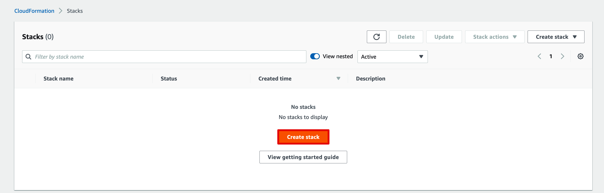
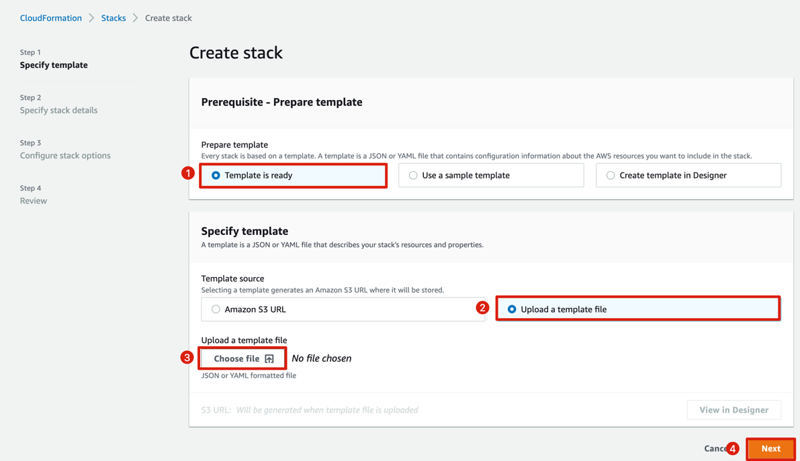
- Specify stack details
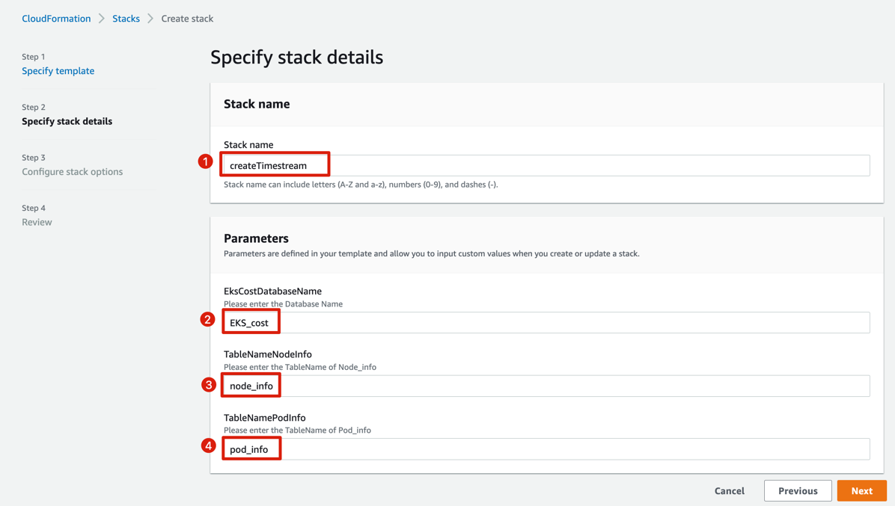
    Parameters|Description|Default value
    --|--|--
    EksCostDatabaseName|Timestream database name|default：`EKS_cost`
    TableNameNodeInfo|Timestream database table for cluster node information|default：`node_info`
    TableNamePodInfo|Timestream database table for cluster pod information|default：`pod_info`


- Click`next`、`next`、`Create stack`to create stack

## Install ekscost and Granafa in the target EKS cluster
### Prerequisites

To be able to follow along with the next steps, you will need to have the following prerequisites:
- AWS CLI version 2. See [Installing, updating, and uninstalling the AWS CLI version 2](https://docs.aws.amazon.com/cli/latest/userguide/install-cliv2.html).
- kubectl. See [Installing kubectl](https://docs.aws.amazon.com/eks/latest/userguide/install-kubectl.html).
- eksctl . See [Installing or upgrading eksctl](https://docs.aws.amazon.com/eks/latest/userguide/eksctl.html#installing-eksctl).
- EKS cluster must be configured with an EKS IAM OIDC Provider. See [Create an IAM OIDC provider for your cluster](https://docs.aws.amazon.com/eks/latest/userguide/enable-iam-roles-for-service-accounts.html). This is a requirement for [IAM roles for service account](https://docs.aws.amazon.com/eks/latest/userguide/iam-roles-for-service-accounts.html) which is used to grant the required AWS permissions to the ekscost and grafana deployments.
- EKS cluster must already be installed with metrics server。See[Installing Kubernetes Metrics Server
](https://docs.aws.amazon.com/eks/latest/userguide/metrics-server.html)

### Setting up Variables

- Before formal installation，Set the following environment variables to store commonly used values.
- **Replace <value>  with your own values below.**
- Replace the value of`DATABASE_NAME` `TABLE_NODE` `TABLE_POD` parameters to the actual value.
```bash
export ACCOUNT_ID= <value>
export CLUSTER_NAME= <value>
export EKS_CLUSTER_REGION= <value>
export TIMESTREAM_REGION= <value>
export DATABASE_NAME=EKS_cost
export TABLE_NODE=node_info
export TABLE_POD=pod_info
```
- Parameter Description

Variables Name|Description
--|--
ACCOUNT_ID|aws account id
CLUSTER_NAME|EKS cluster name
EKS_CLUSTER_REGION|The region where the eks cluster is located
TIMESTREAM_REGION|The region where the Timestream is located
DATABASE_NAME|Timestream database name
TABLE_NODE|Timestream database table for cluster node information
TABLE_POD|Timestream database table for cluster pod information

### Configure the IAM Role
ekscost requires permissions like call EC2 price API or write records to Timestream database. This need to create an AWS IAM Role, Kubernetes service account, and associate them using , and associate them using [IRSA](https://docs.aws.amazon.com/emr/latest/EMR-on-EKS-DevelopmentGuide/setting-up-enable-IAM.html).

#### Create IAM policy
- Create a policy for ekscost that can collect cluster information and write to Timestream

```commandline
cat > ekscost_write_records_policy.json <<EOF
{
    "Version": "2012-10-17",
    "Statement": [
        {
            "Sid": "getec2price",
            "Effect": "Allow",
            "Action": [
                "ec2:DescribeSpotPriceHistory",
                "timestream:DescribeEndpoints",
                "pricing:GetAttributeValues",
                "pricing:GetProducts"
            ],
            "Resource": "*"
        },
        {
            "Sid": "writerecords",
            "Effect": "Allow",
            "Action": "timestream:WriteRecords",
            "Resource": "arn:aws:timestream:$TIMESTREAM_REGION:$ACCOUNT_ID:database/$DATABASE_NAME/table/*"
        }
    ]
}
EOF

aws iam create-policy \
    --policy-name EKSCostWriteRecordsPolicy \
    --policy-document file://ekscost_write_records_policy.json
```   
- Create a policy for Grafana that can query Timestream
```commandline
cat > ekscost_dashboard_policy.json <<EOF
{
    "Version": "2012-10-17",
    "Statement": [
        {
            "Effect": "Allow",
            "Action": [
                "timestream:Select",
                "timestream:DescribeTable",
                "timestream:ListMeasures"
            ],
            "Resource": "arn:aws:timestream:$TIMESTREAM_REGION:$ACCOUNT_ID:database/$DATABASE_NAME/table/*"
        },
        {
            "Effect": "Allow",
            "Action": [
                "timestream:DescribeEndpoints",
                "timestream:SelectValues",
                "timestream:CancelQuery",
                "timestream:ListDatabases"
            ],
            "Resource": "*"
        }
    ]
}
EOF

aws iam create-policy \
    --policy-name EKSCostDashboardPolicy \
    --policy-document file://ekscost_dashboard_policy.json
```
#### Create IAM role,Kubernetes service account
-  Create IAM role and K8S service account for ekscost that can collect cluster information and write to Timestream

```commandline
eksctl create iamserviceaccount \
    --region $EKS_CLUSTER_REGION \
    --name ekscost-writerecords-sa \
    --namespace ekscost \
    --cluster $CLUSTER_NAME\
    --attach-policy-arn arn:aws:iam::$ACCOUNT_ID:policy/EKSCostWriteRecordsPolicy \
    --approve \
    --override-existing-serviceaccounts
 ```  
- Create IAM role and K8S service account for Grafana that can query Timestream
```commandline
eksctl create iamserviceaccount \
    --region $EKS_CLUSTER_REGION \
    --name ekscost-dashboard-sa \
    --namespace ekscost \
    --cluster $CLUSTER_NAME \
    --attach-policy-arn arn:aws:iam::$ACCOUNT_ID:policy/EKSCostDashboardPolicy \
    --approve \
    --override-existing-serviceaccounts
```


### Install ekscost and Grafana in EKS

- download deployment yaml of ekscost
```commandline
wget https://raw.githubusercontent.com/luanluandehaobaoman/ekscost/master/deploy/deployment-ekscost.yaml  
```
- Install with kubectl 
```commandline
envsubst < deployment-ekscost.yaml | kubectl apply -f -  
```
- Obtain the LoadBalancer address of Grafana(By default, the `LoadBalancer` method is used to publish the Grafana service).
```commandline
kubectl -n ekscost get svc
```
- Access grafana in browser via `EXTERNAL-IP`  output in the previous step
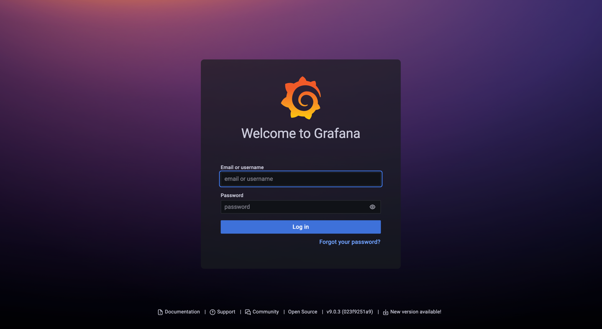
  - username: `admin`
  - password: `admin`
  
## Configure Grafana dashboard
- Install timestream plugin
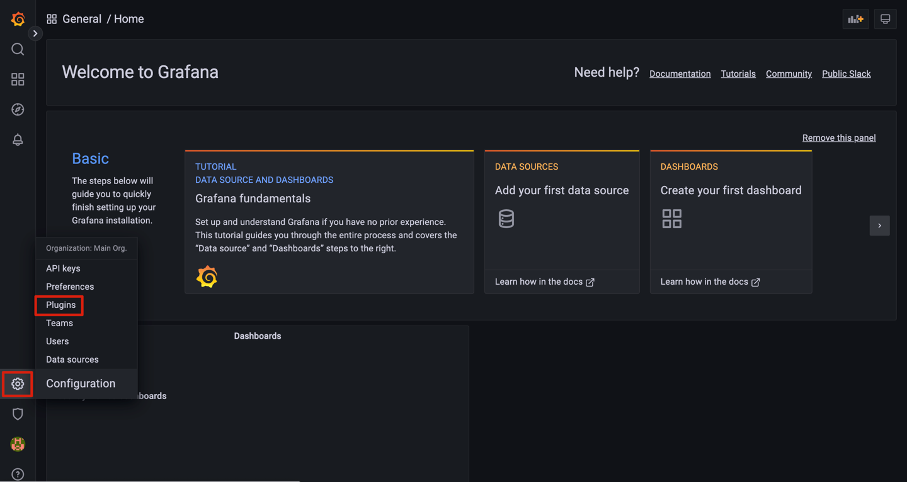
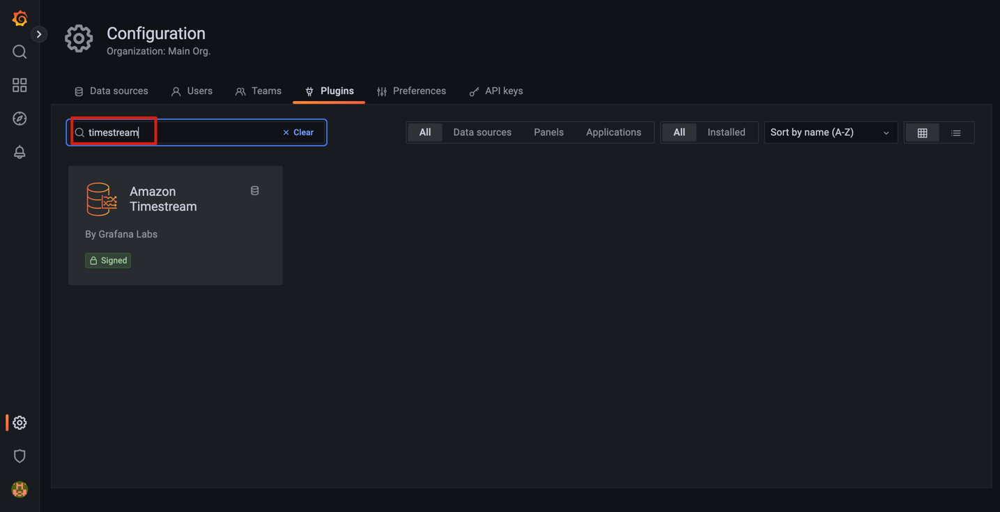
- Configure Data sources,choose 'Amazon Timestream'
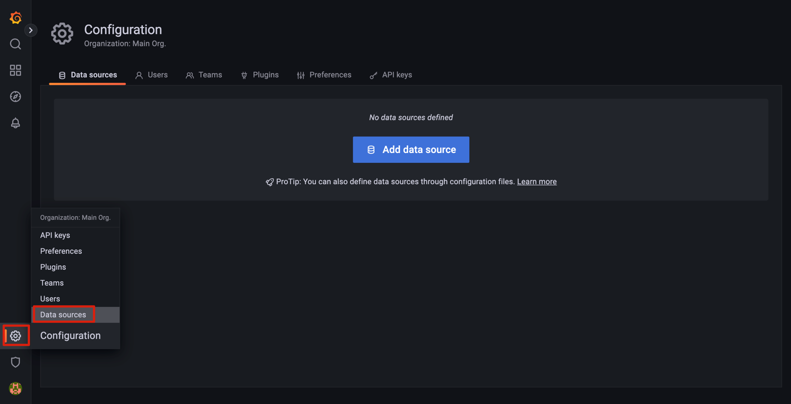
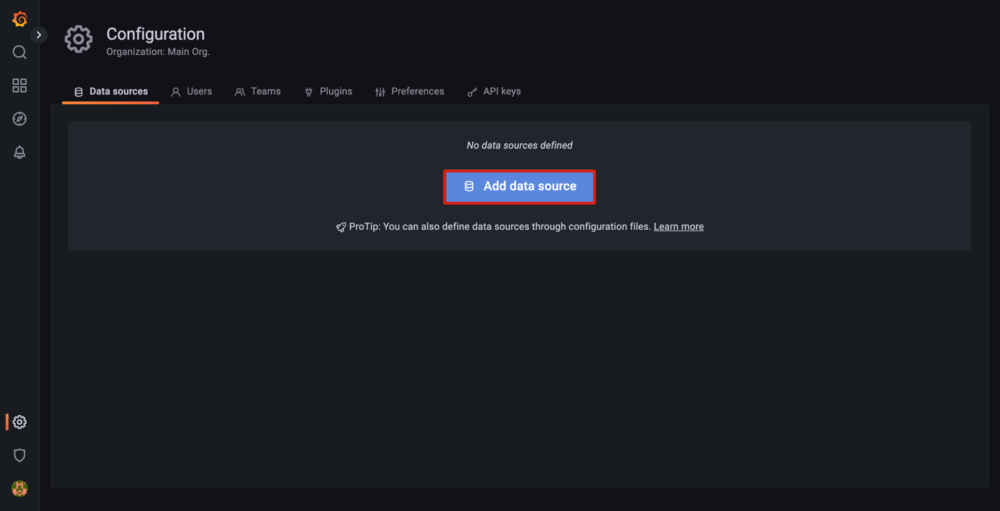
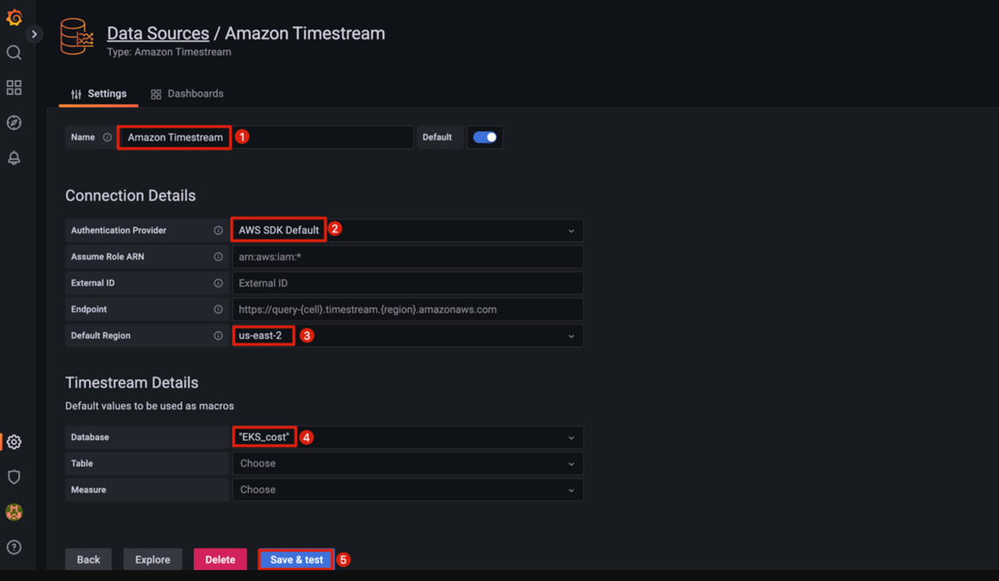
    Options |Description
    --|--
    Name|Datasource name
    Authentication Provider |Specify which credentials chain to use
    Default Region |The region where the Timestream is located
    Database |Timestream database name
- Impoort dashboard with ID `16609`
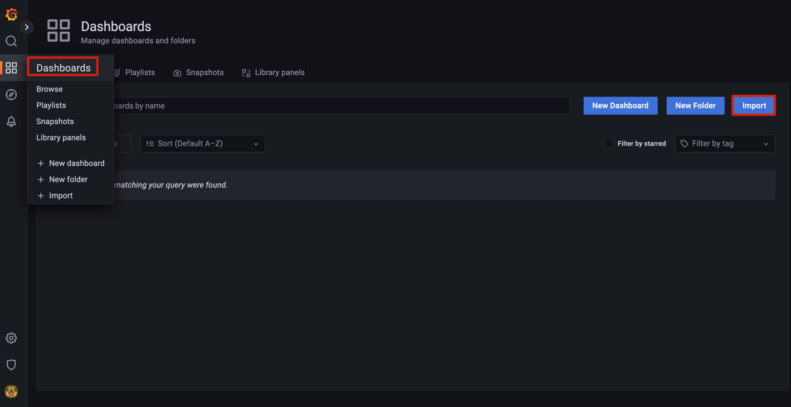
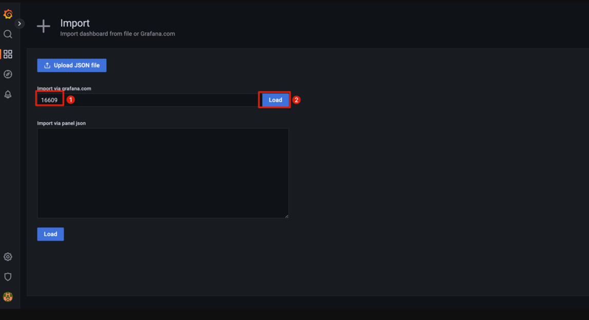
- Configure dashboard options
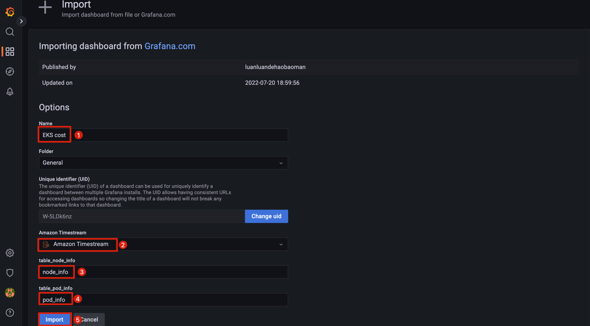
    Options |Description
    --|--
    Name|Dashboard name
    Amazon Timestream|database source of Timestream
    table_node_info |Timestream database table for cluster node information
    table_pod_info |Timestream database table for cluster pod information

Everything should now install successfully!