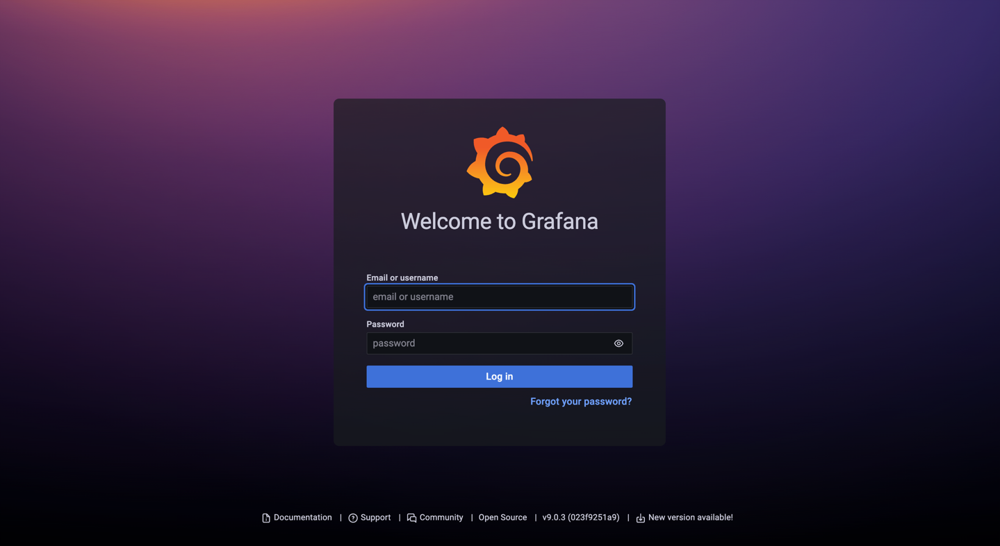
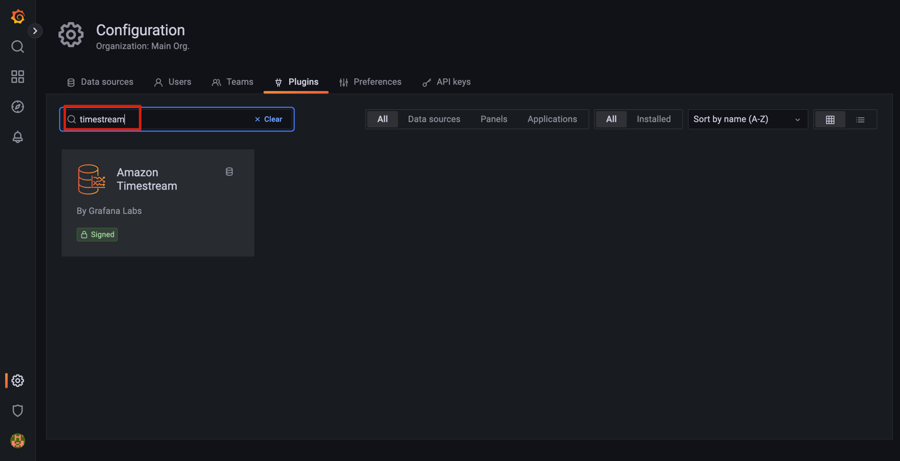

# 部署ekscost

## 创建时序数据库 Timestream
> 注意：
>  - ekscost方案允许EKS集群与Timestream在不同的region
>  - 目前Timestream支持在7个region部署：'us-east-1', 'us-east-2', 'us-west-2', 'eu-west-1', 'eu-central-1', 'ap-southeast-2', 'ap-northeast-1'
>  - （已支持）~~Grafana for timestream plugin暂不支持'ap-southeast-2'(Sydney), 'ap-northeast-1'(Tokyo),已提交[PR](https://github.com/grafana/timestream-datasource/pull/178)~~

- 下载 [cloudformation 模板](https://raw.githubusercontent.com/luanluandehaobaoman/ekscost/master/deploy/CreateTimestream.yaml)
```commandline
wget https://raw.githubusercontent.com/luanluandehaobaoman/ekscost/master/deploy/CreateTimestream.yaml
```


- 在部署 `Timestream`的目标`region` 的`Cloudformation` 控制面板, 上传前一步骤下载的 `CteateTimestream.yaml`


- 指定堆栈详细信息

    Parameters|说明|默认值
    --|--|--
    EksCostDatabaseName|Timestream 数据库名|默认值：`EKS_cost`
    TableNameNodeInfo|存取集群node相关信息的Timestream数据库table名|默认值：`node_info`
    TableNamePodInfo|存取集群pod相关信息的Timestream数据库table名|默认值：`pod_info`


- 以此点击`next`、`next`和`Create stack`完成创建

## 在目标EKS集群安装ekscost和Granafa
### 预置条件

为了能够执行后续步骤，需要具备以下先决条件:
- AWS CLI version，参考 [安装或更新最新版本的 AWS CLI](https://docs.aws.amazon.com/cli/latest/userguide/install-cliv2.html)
- kubectl，参考 [安装kubectl](https://docs.aws.amazon.com/eks/latest/userguide/install-kubectl.html)
- eksctl，参考 [安装或更新eksctl](https://docs.aws.amazon.com/eks/latest/userguide/eksctl.html#installing-eksctl)
- EKS 集群必须已经配置好 EKS IAM OIDC Provider。 参考 [Create an IAM OIDC provider for your cluster](https://docs.aws.amazon.com/eks/latest/userguide/enable-iam-roles-for-service-accounts.html)
- EKS 集群必须已经安装metrics server。参考[Installing Kubernetes Metrics Server
](https://docs.aws.amazon.com/eks/latest/userguide/metrics-server.html)

### 配置bash环境变量

- 在正式安装之前，设置以下环境变量来存放常用值
- **将以下环境变量的 <value>  替换为实际值**
- 如果创建Timestream数据库时未使用默认参数，请替换`EKS_cost` `node_info` `pod_info` 为实际值
```bash
export ACCOUNT_ID=<value>
export CLUSTER_NAME=<value>
export EKS_CLUSTER_REGION=<value>
export TIMESTREAM_REGION=<value>
export DATABASE_NAME=EKS_cost
export TABLE_NODE=node_info
export TABLE_POD=pod_info
```
- Parameter 描述

参数名|描述
--|--
ACCOUNT_ID|aws账户id
CLUSTER_NAME|EKS 集群名
EKS_CLUSTER_REGION|EKS集群所在region，例如`us-east-1`
TIMESTREAM_REGION|Timestream数据库所在region，例如`us-east-1`
DATABASE_NAME|Timestream数据库名称
TABLE_NODE|存取集群node相关信息的Timestream数据库table名
TABLE_POD|存取集群pod相关信息的Timestream数据库table名

### 配置 IAM Role
ekscost 需要调用 EC2 price API 以及将record写入 Timestream 数据库等权限。 这需要创建AWS IAM role和Kubernetes 服务账户，并通过 [IRSA](https://docs.aws.amazon.com/emr/latest/EMR-on-EKS-DevelopmentGuide/setting-up-enable-IAM.html)进行关联

#### 创建 IAM policy
- 为 ekscost 创建一个可以收集集群信息并写入 Timestream 的策略

```commandline
cat > ekscost_write_records_policy.json <<EOF
{
    "Version": "2012-10-17",
    "Statement": [
        {
            "Sid": "getec2price",
            "Effect": "Allow",
            "Action": [
                "ec2:DescribeSpotPriceHistory",
                "timestream:DescribeEndpoints",
                "pricing:GetAttributeValues",
                "pricing:GetProducts"
            ],
            "Resource": "*"
        },
        {
            "Sid": "writerecords",
            "Effect": "Allow",
            "Action": "timestream:WriteRecords",
            "Resource": "arn:aws:timestream:$TIMESTREAM_REGION:$ACCOUNT_ID:database/$DATABASE_NAME/table/*"
        }
    ]
}
EOF

aws iam create-policy \
    --policy-name EKSCostWriteRecordsPolicy \
    --policy-document file://ekscost_write_records_policy.json
```   
- 为Grafana创建可以查询Timestream的策略
```commandline
cat > ekscost_dashboard_policy.json <<EOF
{
    "Version": "2012-10-17",
    "Statement": [
        {
            "Effect": "Allow",
            "Action": [
                "timestream:Select",
                "timestream:DescribeTable",
                "timestream:ListMeasures"
            ],
            "Resource": "arn:aws:timestream:$TIMESTREAM_REGION:$ACCOUNT_ID:database/$DATABASE_NAME/table/*"
        },
        {
            "Effect": "Allow",
            "Action": [
                "timestream:DescribeEndpoints",
                "timestream:SelectValues",
                "timestream:CancelQuery",
                "timestream:ListDatabases"
            ],
            "Resource": "*"
        }
    ]
}
EOF

aws iam create-policy \
    --policy-name EKSCostDashboardPolicy \
    --policy-document file://ekscost_dashboard_policy.json
```
#### 创建 IAM role并关联Kubernetes service account
-  ekscost

```commandline
eksctl create iamserviceaccount \
    --region $EKS_CLUSTER_REGION \
    --name ekscost-writerecords-sa \
    --namespace ekscost \
    --cluster $CLUSTER_NAME\
    --attach-policy-arn arn:aws:iam::$ACCOUNT_ID:policy/EKSCostWriteRecordsPolicy \
    --approve \
    --override-existing-serviceaccounts
 ```  
- grafana
```commandline
eksctl create iamserviceaccount \
    --region $EKS_CLUSTER_REGION \
    --name ekscost-dashboard-sa \
    --namespace ekscost \
    --cluster $CLUSTER_NAME \
    --attach-policy-arn arn:aws:iam::$ACCOUNT_ID:policy/EKSCostDashboardPolicy \
    --approve \
    --override-existing-serviceaccounts
```


### 在EKS集群安装 ekscost 和 Grafana

- 下载部署yaml
```commandline
wget https://raw.githubusercontent.com/luanluandehaobaoman/ekscost/master/deploy/deployment-ekscost.yaml  
```
- 通过`kubectl`安装 
```commandline
envsubst < deployment-ekscost.yaml | kubectl apply -f -  
```
- 获取grafana的ELB服务地址(默认通过 `LoadBalancer` 方式发布服务)
```commandline
kubectl -n ekscost get svc
```
- 在浏览器输入前一步骤获取的 `EXTERNAL-IP`  访问grafana

  - username: `admin`
  - password: `admin`
  
## 配置 Grafana dashboard
- 安装 timestream plugin


- 配置 Data sources,选择 'Amazon Timestream'


    选项 |描述
    --|--
    Name|Datasource 名称
    Authentication Provider |指定要使用的认证方式
    Default Region |Timestream数据库所在region
    Database |Timestream 数据库名
- 通过 dashboard ID `16609`导入面板


- 配置 dashboard 选项

    选项 |描述
    --|--
    Name|Dashboard 名称
    Amazon Timestream|Timestream数据源
    table_node_info |存取集群node相关信息的Timestream数据库table名
    table_pod_info |存取集群pod相关信息的Timestream数据库table名

