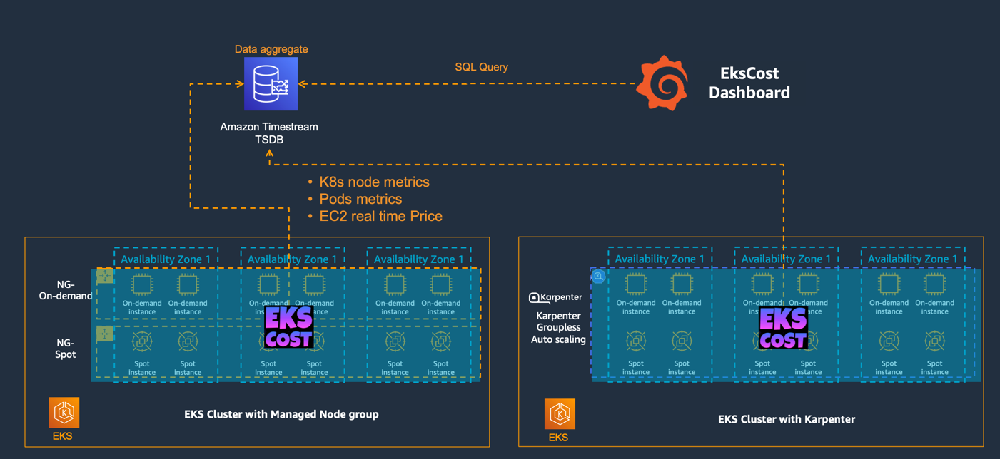

# Overview
- The EKS cluster cost includes a fixed portion of the control plane ($0.10 per hour) and computing costs for running Kubernetes worker nodes. 
- However, because the Pod and the billing unit are not in a one-to-one relationship, and the life cycle of the Pod is different from the billing cycle, there are many EC2 instance types, dynamic changes in spot instance prices, and dynamic scaling of worker nodes, which lead to the cost analysis and optimization  of EKS  become very difficult.
- *EKScost is a solution for EKS cluster cost visualization*. It displays the computing cost of EKS cluster in detail, which can help enterprise IT cost managers to understand cluster resource usage and cost distribution from multiple dimensions, so as to provide suggestions for cluster cost optimization.
  - Grafana dashboard of ekscost
  
  
  
  
## Function
- Cloud resource cost display
Through the combination of usage statistics and real-time inquiry, the accurate estimation of the computing cost of the cluster is realized, and all computing resource costs under the EKS cluster are aggregated and displayed, and the overall cost of the cluster on the current day/week/month can be viewed in real time.

- Cluster fee trend analysis
View the consumption trends of all computing resources under the EKS cluster, including dimensions such as pod, namespace, and node, to assist in cost-saving decisions.

- Cluster resource cost sharing
According to the cost ratio of splitting the cluster by pod and namespace, it provides real-time query in any time interval.

- Application cost optimization
View the effective request ratio (actually used resources/requested resources) of pods, including CPU and Memory, to provide cost optimization analysis capabilities in the application dimension.
# Architecture
The backend program ekscost deployed in each eks cluster periodically collects EKS cluster resource information and node price information, stores it in the time series database Amazon Timestream, and then displays it centrally through grafana.
 
## Information collected from the EKS cluster includes:
- pod
  - pod_request_cpu
  - pod_request_memory
  - pod_utilization_cpu
  - pod_utilization_memory
- node
  - node_allocatable_cpu
  - node_allocatable_memory
  - node_capacityType
  - node_instance_type
  - node_price

## Database schema of Timestream
Each cluster has two tables in Timestream:
- pod

Column|Type|Timestream attribute type
--|--|--
cluster|varchar|DIMENSION
measure_name	|varchar	|MEASURE_NAME
namespace	|varchar	|MULTI
node_name	|varchar	|MULTI
pod_request_cpu	|double|	MULTI
pod_request_memory|	double	|MULTI
pod_utilization_cpu|	double	|MULTI
pod_utilization_memory|double	|MULTI
time	|timestamp|	TIMESTAMP

- node

Column|Type|Timestream attribute type
--|--|--
cluster|varchar|DIMENSION
measure_name|	varchar	|MEASURE_NAME
node_allocatable_cpu|	double|	MULTI
node_allocatable_memory|	double|	MULTI
node_capacityType|	varchar	|MULTI
node_instance_type	|varchar|	MULTI
node_price|	double	|MULTI
node_region	|varchar|	MULTI
node_zone	|varchar	|MULTI
time	|timestamp	|TIMESTAMP


## Price calculation model
- Pod
  - Pod hourly cost=(Request cpu/node allocatable cpu+Request mem/node allocatable mem)/2*Node unit price
  
# Install
The [documentation](https://github.com/luanluandehaobaoman/ekscost/blob/master/Doc/Install%20ekscost.md#install-ekscost) provides a guide to install ekscost.

# Timestream SQL query example in Grafana
- Node cost trends by DAY
```commandline
WITH pod_day_cost AS (
		WITH pod_cost AS (
				WITH cpu AS (
						WITH a AS (
								SELECT node_name, measure_name, avg(pod_utilization_cpu) AS pod_utilization_cpu
									, bin(time, 3600s) AS binned_timestamp
								FROM $__database.$table_pod_info
								where $__timeFilter
								GROUP BY node_name, measure_name, bin(time, 3600s)
							), 
							b AS (
								SELECT measure_name AS node_name, avg(node_price) AS node_price, avg(node_allocatable_cpu) AS node_allocatable_cpu
									, bin(time, 3600s) AS binned_timestamp
								FROM $__database.$table_node_info
								where $__timeFilter
								GROUP BY measure_name, bin(time, 3600s)
							)
						SELECT a.measure_name, a.binned_timestamp, a.pod_utilization_cpu / b.node_allocatable_cpu * b.node_price AS cpu_cost
						FROM a
							JOIN b
							ON a.node_name = b.node_name
								AND a.binned_timestamp = b.binned_timestamp
					), 
					mem AS (
						WITH a AS (
								SELECT node_name, measure_name, avg(pod_utilization_memory) AS pod_utilization_memory
									, bin(time, 3600s) AS binned_timestamp
								FROM $__database.$table_pod_info
								where $__timeFilter
								GROUP BY node_name, measure_name, bin(time, 3600s)
							), 
							b AS (
								SELECT measure_name AS node_name, avg(node_price) AS node_price, avg(node_allocatable_memory) AS node_allocatable_memory
									, bin(time, 3600s) AS binned_timestamp
								FROM $__database.$table_node_info
								where $__timeFilter
								GROUP BY measure_name, bin(time, 3600s)
							)
						SELECT a.measure_name, a.binned_timestamp, a.pod_utilization_memory / b.node_allocatable_memory * b.node_price AS memory_cost
						FROM a
							JOIN b
							ON a.node_name = b.node_name
								AND a.binned_timestamp = b.binned_timestamp
					)
				SELECT cpu.measure_name, cpu.binned_timestamp, (cpu.cpu_cost + mem.memory_cost) / 2 AS pod_cost
				FROM cpu
					JOIN mem
					ON cpu.measure_name = mem.measure_name
						AND cpu.binned_timestamp = mem.binned_timestamp
			)
		SELECT measure_name, bin(binned_timestamp, 1d) AS one_day
			, sum(pod_cost) AS pod_cost_one_day
		FROM pod_cost
		GROUP BY measure_name, 2
	)
SELECT measure_name, CREATE_TIME_SERIES(one_day, pod_cost_one_day) AS " "
FROM pod_day_cost
GROUP BY measure_name
```
- Node cost trends by DAY
```commandline
WITH b AS (
		WITH a AS (
				SELECT measure_name, avg(node_price) AS avg_price
					, bin(time, 1h) AS binned_timestamp
				FROM $__database.$table_node_info
				WHERE $__timeFilter
				GROUP BY measure_name, bin(time, 1h)
				ORDER BY bin(time, 1h) ASC
			)
		SELECT measure_name, sum(avg_price) AS sum_price
			, bin(binned_timestamp, 1d) AS binned_timestamp_day
		FROM a
		GROUP BY measure_name, bin(binned_timestamp, 1d)
	)
SELECT measure_name, CREATE_TIME_SERIES(binned_timestamp_day, sum_price) AS node_cost_per_day
FROM b
GROUP BY measure_name
```
For full SQL query please refer to [ekscost dashboard](https://grafana.com/grafana/dashboards/16609)